<picture>
  <source media="(prefers-color-scheme: dark)" srcset="./assets/dark.svg">
  <source media="(prefers-color-scheme: light)" srcset="./assets/light.svg">
  
</picture>

## `whoami`

Cybersecurity professional focused on **SIEM operations, detection engineering, adversary simulation, internal offensive security, and secure systems development**.

```text
Primary stack : QRadar • Splunk • MITRE Caldera • Sigma • Python • Linux
Current focus : Reliable detections, rule validation, IDCA operations, purple teaming
Portfolio     : https://breachion.com
```

## `mission`

I turn adversary behavior into measurable, testable, and operational detections. My work combines offensive validation with defensive engineering so that security rules are not merely present—they are proven to work.

## `capabilities`

| Area | Focus |
|---|---|
| SIEM Engineering | QRadar, Splunk, correlation rules, offense analysis, log-source validation |
| Detection Engineering | Sigma, Windows telemetry, custom fields, false-positive reduction |
| Adversary Simulation | MITRE Caldera, atomic testing, IDCA, purple-team workflows |
| Infrastructure Security | Linux, Windows, VMware, FortiGate, network and access controls |
| Secure Development | Python, Django, automation, security-focused internal tooling |

## `current_operations`

- Building and validating SIEM detections against realistic attack behavior
- Improving Caldera-based adversary simulation workflows
- Developing Breachion security services and technical products
- Designing repeatable purple-team and detection-validation processes

## `contact`

- Website: [breachion.com](https://breachion.com)
- GitHub: replace this line with your final GitHub profile URL
- LinkedIn: replace this line with your LinkedIn profile URL
